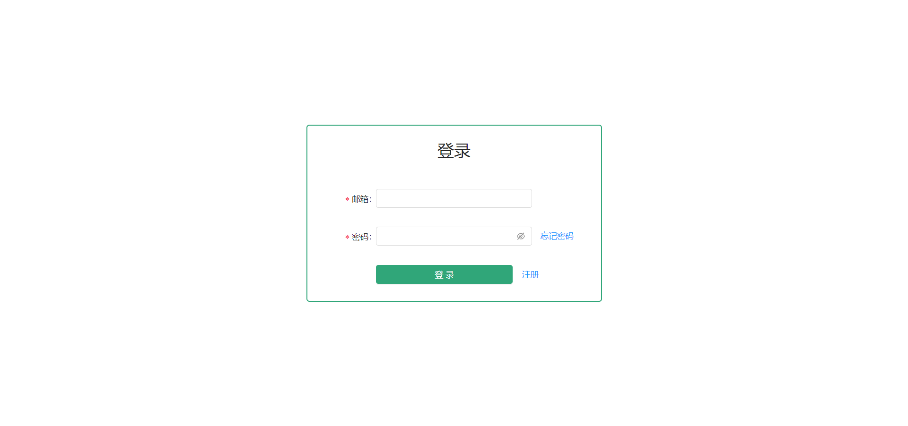
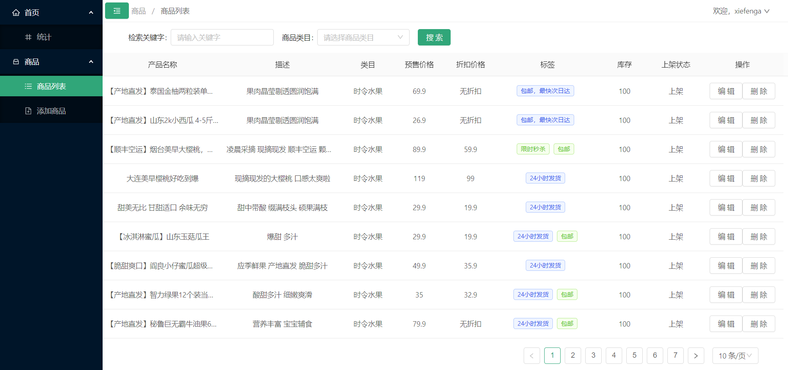
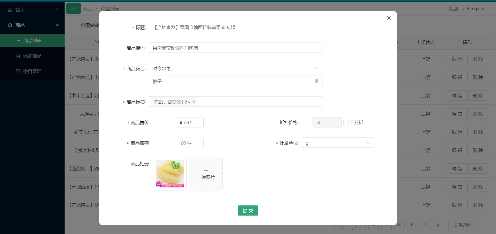
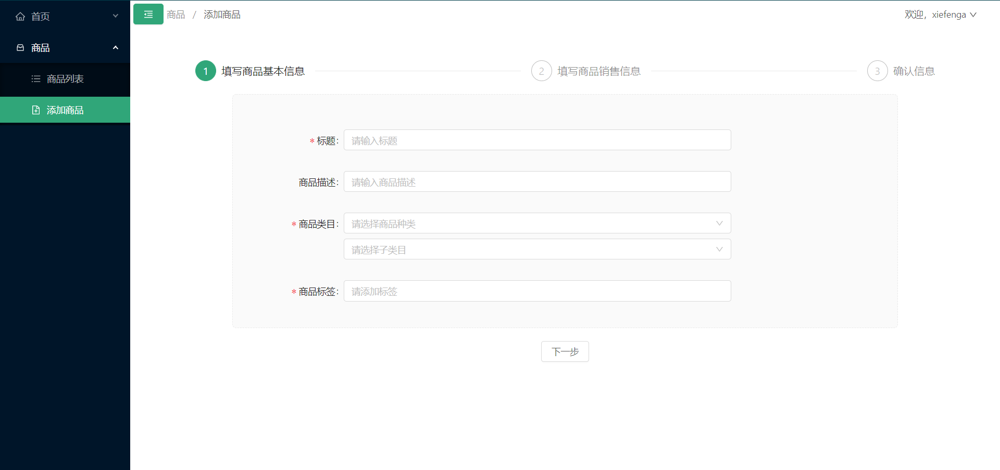
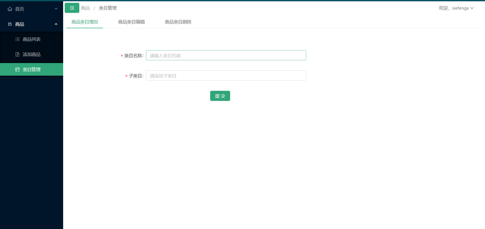

# 每日优鲜B端项目

技术栈：vue全家桶 + axios + antd for vue

实现了登录、注册、忘记密码，产品分页获取，编辑、删除、添加，产品类目的编辑、添加、删除。

不同身份（customer、admin）的用户权限（路由）不同。

## 启动方式
```shell

npm install

npm run serve
```

## 项目预览









